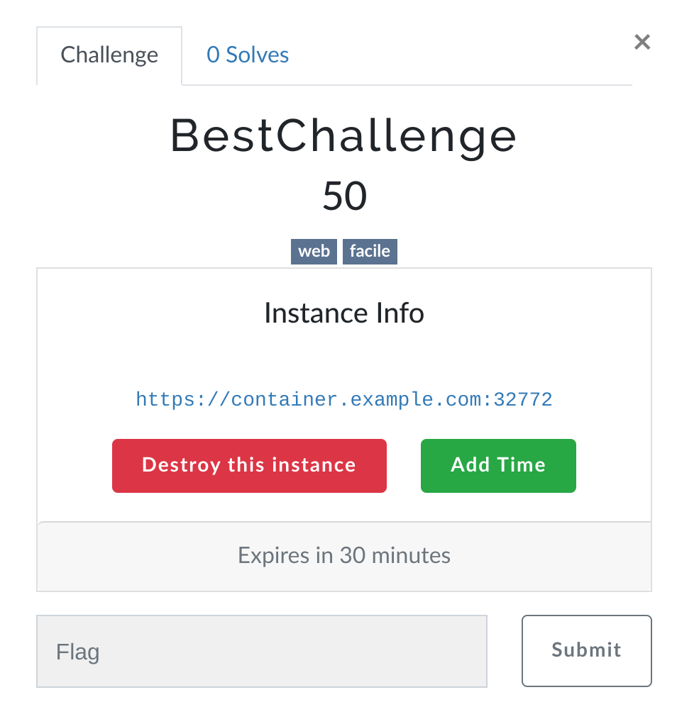

# CTFd Docker Containers Plugin


This CTFd plugin allows you to run ephemeral Docker containers for specific challenges. Users can request a container to use as needed, and its lifecycle will be managed by the plugin.

## Usage

### Installation

Go to your CTFd/plugins folder and execute following commands:

```shell
git clone https://github.com/Bigyls/CTFdDockerContainersPlugin.git containers
cd containers
pip install -r requirements.txt
```

Restart your ctfd.

### Configuration

To configure the plugin, go to the admin page, click the dropdown in the navbar for plugins, and go to the Containers page (https://example.com/containers/settings). 

Then you can click the settings button to configure the connection. You will need to specify some values, including the connection string to use. This can either be the local Unix socket, or an TCP connection. If using Docker Compose CTFd installation, you can map docker socket into CTFd container by modifying the docker-compose.yml file ([Be careful to best pratices](https://cheatsheetseries.owasp.org/cheatsheets/Docker_Security_Cheat_Sheet.html#rule-1-do-not-expose-the-docker-daemon-socket-even-to-the-containers)):

```yml
 services:
   ctfd:
     ...
     volumes:
     ...
       - /var/run/docker.sock:/var/run/docker.sock
     ...
```

The other options are described on the page. After saving, the plugin will try to connect to the Docker daemon and the status should show as an error message or as a green symbol (maybe restart ctf to be sure).

To create challenges, use the container challenge type and configure the options. It is set up with dynamic scoring, so if you want regular scoring, set the maximum and minimum to the same value and the decay to zero.

It's also possible to configure auto deployment using [ctfcli](https://github.com/CTFd/ctfcli) and its YAML configuration:

```yaml
name: BestChallenge
...
type: container
value: 50
extra:
  initial: 50
  decay: 75
  minimum: 10
  image: bestchallenge:latest
  port: 1337

connection_info: https://container.example.com
...
```

If you need to specify advanced options like the volumes, read the [Docker SDK for Python documentation](https://docker-py.readthedocs.io/en/stable/containers.html) for the syntax, since most options are passed directly to the SDK.

When a user clicks on a container challenge, a button labeled "Start Instance" appears. Clicking it shows the information below with a random port assignment.



## Roadmap

- [ ] Possibility to use 2 docker TCP connection method (like 1 windows and 1 linux).
- [ ] Add logging.
- [x] Only one docker per team.
- [x] Make it work with Team mode.
- [x] Tests with 3.7 CTFd.

## Contributing

You can create issues and PRs by yourself if you experienced a bug, have questions or if you have an idea for a new feature. This repository aims to remain active, up to date and scalable.

## Credits

Based on https://github.com/andyjsmith/CTFd-Docker-Plugin.
