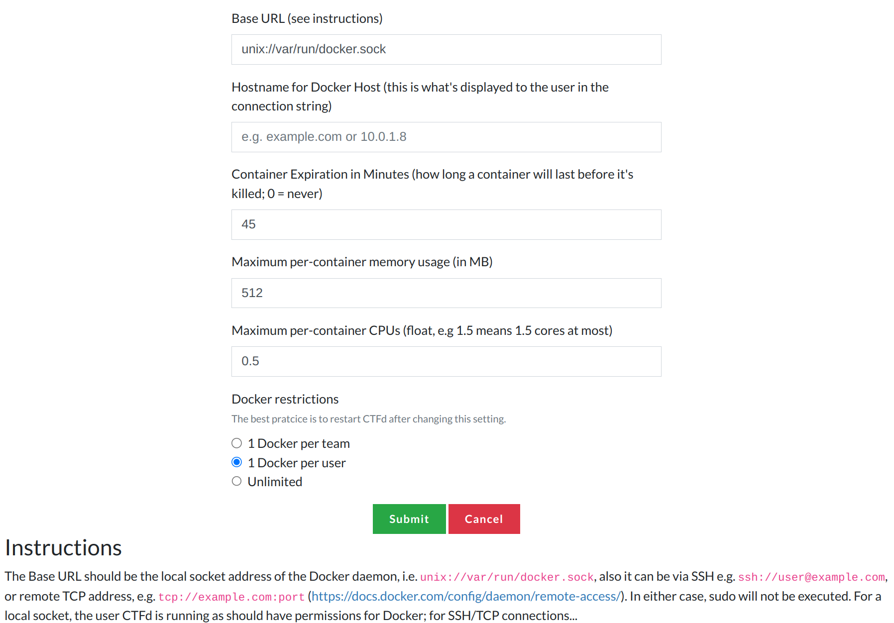

# CTFd Docker Containers Plugin


This CTFd plugin allows you to run ephemeral Docker containers for specific challenges. Users can request a container to use as needed, and its lifecycle will be managed by the plugin.

## Usage

### Installation

#### On premise

Go to your CTFd/plugins folder and execute following commands:

```shell
git clone https://github.com/Bigyls/CTFdDockerContainersPlugin.git containers
cd containers
pip install -r requirements.txt
```

Restart your ctfd.

#### Docker Compose

You will need to specify some values, including the docker connection type to use.

If you are using Docker Compose CTFd installation, you can map docker socket into CTFd container by modifying the docker-compose.yml file ([Be careful to best pratices](https://cheatsheetseries.owasp.org/cheatsheets/Docker_Security_Cheat_Sheet.html#rule-1-do-not-expose-the-docker-daemon-socket-even-to-the-containers)):

```yml
 services:
   ctfd:
     ...
     volumes:
     ...
       - /var/run/docker.sock:/var/run/docker.sock
     ...
```

Then, go to your CTFd/plugins folder and execute following command:

```shell
git clone https://github.com/Bigyls/CTFdDockerContainersPlugin.git containers
```

Re-build your docker-compose:

```shell
docker-compose down
docker-compose up --build
```

### Configuration

To configure the plugin, go to the admin page, click the dropdown in the navbar for plugins, and go to the Containers page (https://example.com/containers/settings).



Other options are described on the page. After saving (`Submit` button), the plugin will try to connect to the Docker daemon and the status should show as an error message or as a green symbol on dashboard (**maybe restart ctf to be sure**).

## Demo

### Add challenge

To create challenges, use the container challenge type and configure the options. It is set up with dynamic scoring, so if you want regular scoring, set the maximum and minimum to the same value and the decay to 1.

Go to https://example.com/admin/challenges/new and select container challenge type and fill all the required fields:


In the docker image field, it allows you to select the docker image already builded on the machine:


If you need to specify advanced options like the volumes, read the [Docker SDK for Python documentation](https://docker-py.readthedocs.io/en/stable/containers.html) for the syntax, since most options are passed directly to the SDK.

#### Auto deployment

It's also possible to configure auto deployment using [ctfcli](https://github.com/CTFd/ctfcli) and its YAML configuration:

```yaml
name: BestChallenge
...
type: container
value: 50
extra:
  initial: 50
  decay: 75
  minimum: 10
  image: bestchallenge:latest
  port: 1337

connection_info: https://container.example.com
...
```

### Admin view

Admin can manage created containers at https://example.com/containers/dashboard.


### User view

When a user clicks on a challenge with container, a button labeled "Start Instance" appears. Clicking it shows the information below with a random port assignment.

Web             |  TCP
:-------------------------:|:-------------------------:
 |  

All connections types are supported (HTTP, HTTPS, TCP, UDP, OPCUA, MQTT, ZeroMQ, ...).

### Logs

The plugin logs all actions in the CTFd logs folder (`CTFd/CTFd/logs`) into the `containers.log` file.

There is 3 levels of logging: 
- INFO : User actions
- DEBUG : Help for diagnostics
- ERROR : What more can I say

### Rate limits

If the CTF is a physical event, be careful about limits at API endpoints. Feel free to change values or remove them by commenting them.

## Roadmap
- [ ] Write tests.
- [ ] Not only restriction to 1 docker per team/user, change settings to input how many (max) container per team/user.  
- [ ] Possibility to use 2 docker TCP connection method (like 1 windows and 1 linux).
- [x] Add exhaustive logging.
- [x] Add docker restrictions (1 docker per team, 1 docker per user, unlimited).
- [x] Make it work with User and Team mode.
- [x] Tests with 3.7 CTFd.

## Contributing

You can create issues and PRs by yourself if you experienced a bug, have questions or if you have an idea for a new feature. This repository aims to remain active, up to date and scalable.

## Credits

Project Link: https://github.com/Bigyls/CTFdDockerContainersPlugin

Based on: https://github.com/andyjsmith/CTFd-Docker-Plugin
